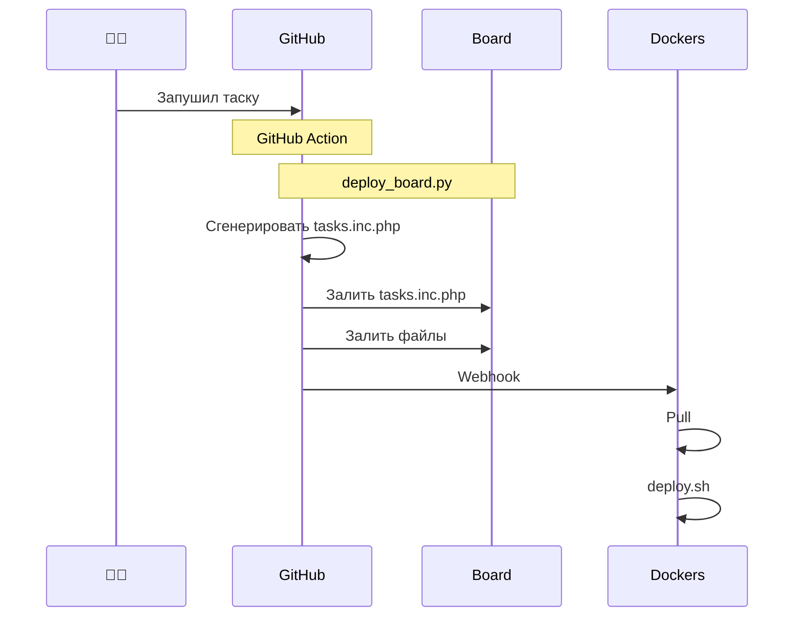

# Как мы делали сезон

---

<Confetti class="w-full h-full"/>

---

# Стата

<ul>
  <li v-click>12 сходок</li>
  <li v-click>6 месяцев</li>
  <li v-click>146 тасков</li>
</ul>

---
layout: fact
---

## Как мы подымаем таски? 🤔

---

# Turing complete board

<div class="w-full h-full flex flex-col justify-center">
  
</div>

---

# Turing complete board

```php {all|7}
class pwn3_ints extends BaseTask {
    public $desc = 'ints', $cat = 'ret2libc', $cost = 10;
    public $answer = 'spbctf{123213213131}';
    public $caseInsensitive = true;
    public $author = "George Zaytsev (<a href='tg://resolve?domain=groke'>groke</a>)";
    public $fullDesc = "<p>Server: </p><p><code><b>nc -nv 109.233.56.90 11635</b></code></p><p>Binary: <a href='/files/aslr/ints/task_simple'><b>task</b></a></p><p>libc:<a href='/files/aslr/ints/libc-2.31.so'>libc</a></p><p><a href='/files/aslr/ints/ld-2.31.so'>ld</a></p>";
    public function Validate($answer) {}
}
```

---
layout: center
---


---

# GitOoops


---
layout: center
---


---
layout: center
---


---

# Новый деплой

- GitHub репа
- `deploy.sh`
- `deploy.yaml`
- `deploy_board.py`
- Деплой вебхук на TypeScript 🤡

```
├── 11-heap4
│   ├── mc1
│   │   ├── deploy
│   │   │   ├── docker-compose.yml
│   │   │   ├── Dockerfile
│   │   │   ├── flag.txt
│   │   │   ├── main.c
│   │   │   ├── Makefile
│   │   │   └── mc1.elf
│   │   ├── solve1.py
│   │   └── task.yaml
│    ...
├── deploy.sh
└── deploy.yaml
```

---
layout: center
---


```mermaid {theme: 'dark', scale: 0.8}
sequenceDiagram
  🧑‍🏫->>GitHub: Запушил таску
  Note over GitHub: GitHub Action
  Note over GitHub,Board: deploy_board.py
  GitHub->>GitHub: Сгенерировать tasks.inc.php
  GitHub->>Board: Залить tasks.inc.php
  GitHub->>Board: Залить файлы
  GitHub->>Dockers: Webhook
  Dockers->>Dockers: Pull
  Dockers->>Dockers: deploy.sh
```

---


---

# QA Team

```shell
$ diff give_to_ctfers/write_me_not1 deploy/write_me_not
Binary files give_to_ctfers/write_me_not1 and deploy/write_me_not differ
```

---
layout: center
---


---
layout: center
---


---
layout: center

---


---

# Brrrrrrrrrrr

```c {all|8}
void play() {
    puts("We can leak canary with a C string!!");
    char buf[16];
    while (1) {
        printf("What is your name?\n");
        fflush(stdout);
        int res = read(0, buf, 128);
        if (res == -1) break;

        if (buf[0] == 'q') break;

        printf("Hello %s !\n", buf);
    }
}
```

---


---
layout: center
---


---

# Misc optimisations

`/etc/docker/daemon.json`
```json {all|1-5|6-7|8}
{
  "log-driver": "local",
  "log-opts": {
    "max-size": "100m",
    "max-file": "3"
  },
  "userland-proxy": false,
  "iptables": true,
  "live-restore": true
}
```

---

# Misc optimisations

`main.c`
```c
__attribute__((constructor))
static void bufinit() {
    setvbuf(stdout, 0, _IONBF, 0);
    setvbuf(stdin, 0, _IONBF, 0);
    setvbuf(stderr, 0, _IONBF, 0);
}
```